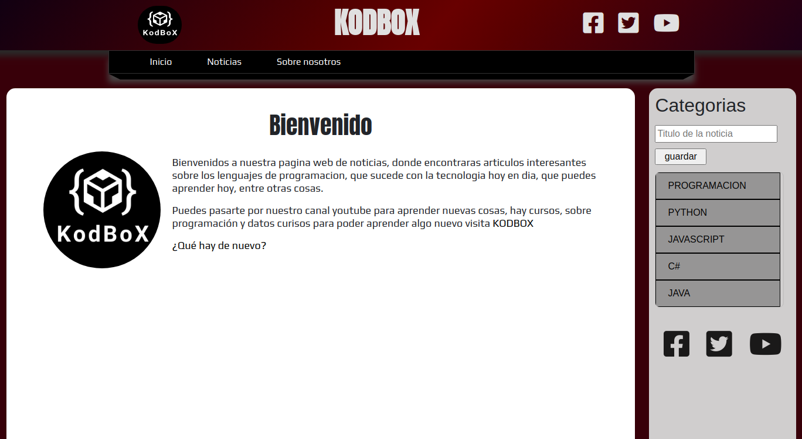
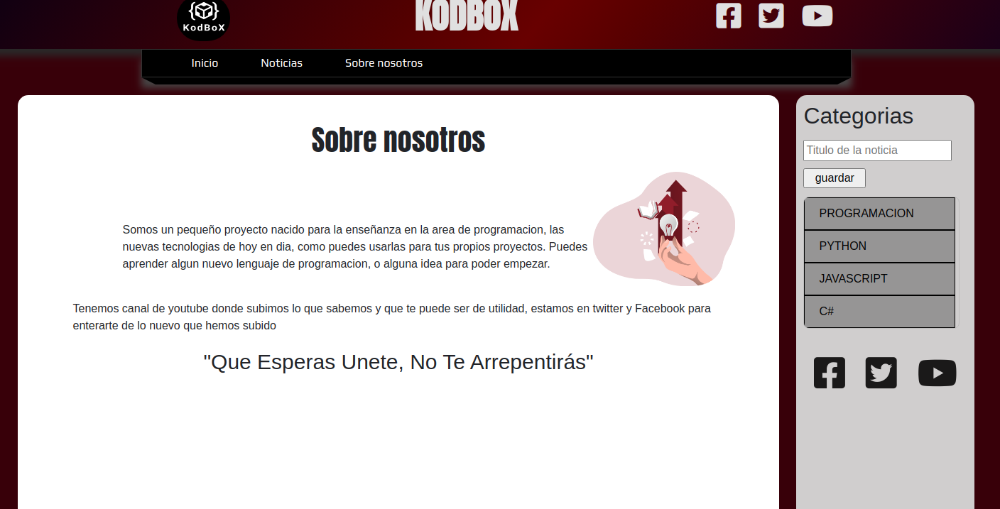
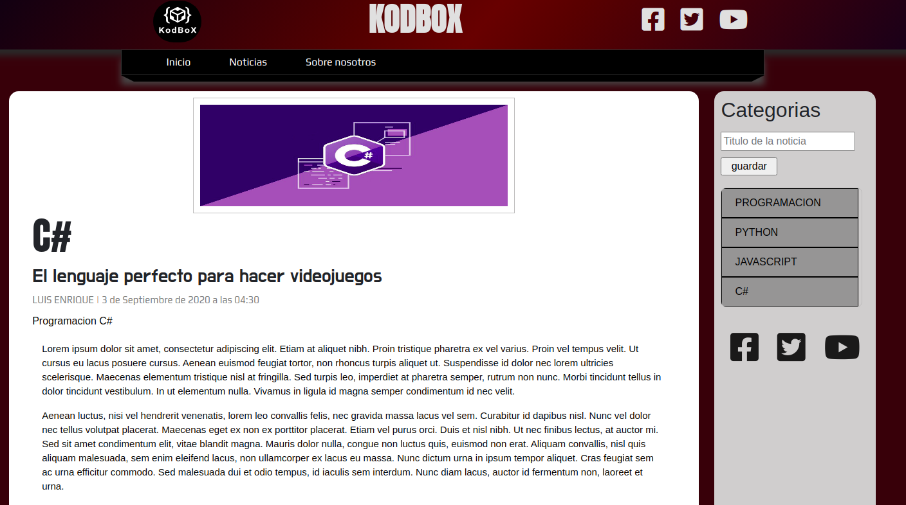
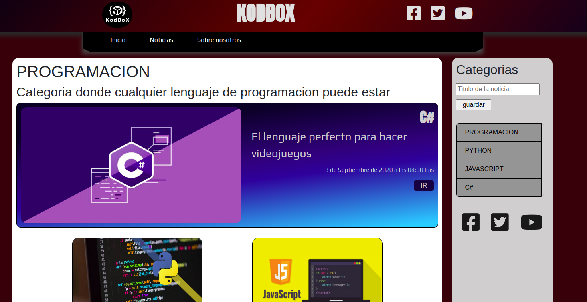
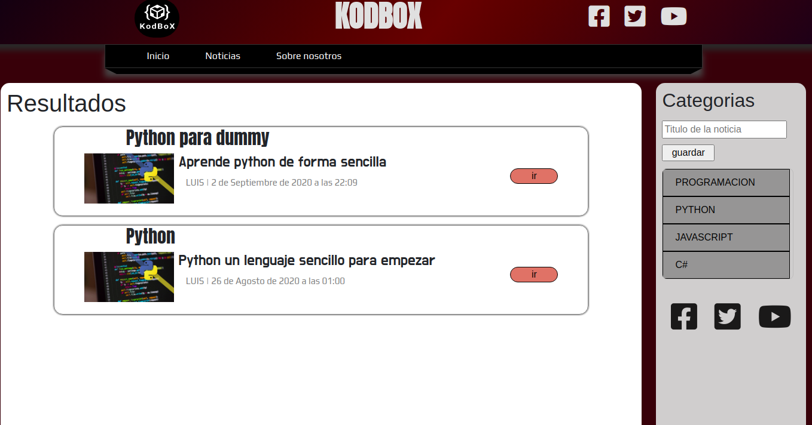

# kodbox 🗂
> Crea blog de noticias de programación.

## Pre-requisitos 🔧
Necesitamos instalar

```bash
pip install -r requirements.txt
```

## En ejecucion 🖥
Una vez instalado vamos a ir a `manage.py`, el cual vamos a hacer la migracion y un super usuario

```bash
python manage.py migrate
python manage.py createsuperuser

```
### Ejecutar ⚒

```bash

python manage.py runserver

```

## Rutas 🔰

## Inico y sobre nosotros
Primero que nada da la bienvenida a la pagina principal
<br>

<hr>

<br>

## Noticias
En la pagina de ***Noticias*** tenemos la muestra del titulo, subtitulo, imagen y el dia de creacion, con el boton de ir.
Se divide en Noticia principal, noticias secuandarios
<br>

### Noticias Individual
Cada noticia te lleva a su contenido
<br>

<br>

### Categorias
Usando las categorias de cada una de las Noticias, puede llevarte a la lista de solo las noticias por categorias.
<br>

<br>

### Busquedas
La busqueda funciona por un metodo post, la cual busca todas las noticias publicas y que en su nombre venga esa palabra
<br>

<br>

## Construido con: 🛠

La herramienta utiliza para su creacion

* [Django](https://www.djangoproject.com/) - Framework de python

## Autor
* **Luis Ocampo** - *Programador* - [luisblash3](https://twitter.com/luisblash3)

